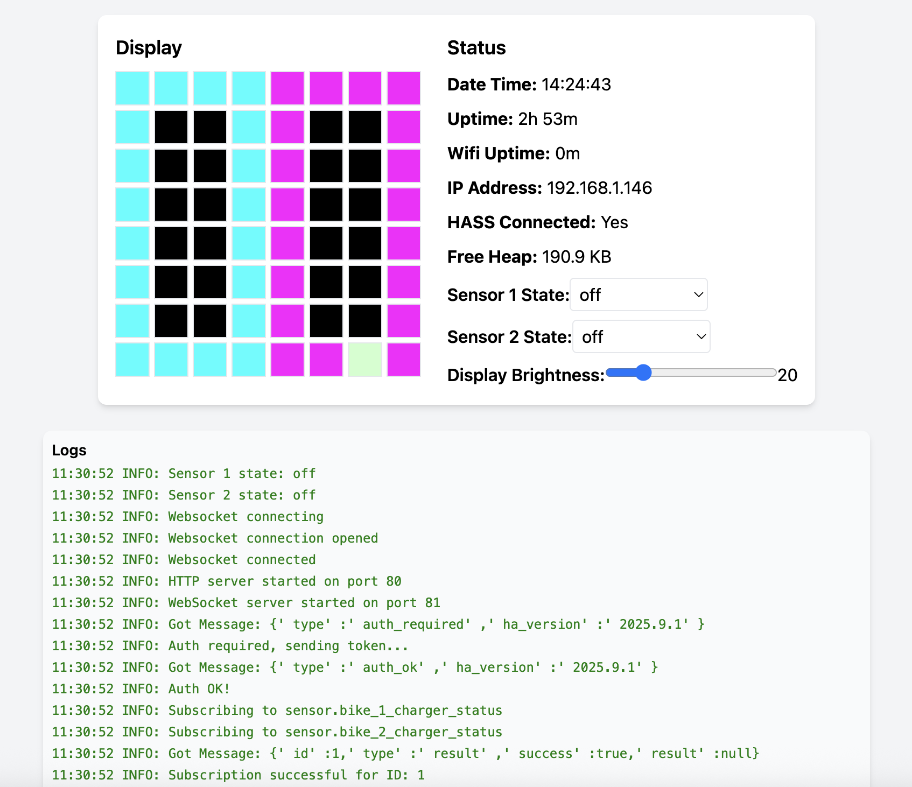

# Charger Display

This project is a custom-built, WiFi-enabled status display for monitoring two e-bike chargers integrated with Home Assistant. It uses an ESP32 and an 8x8 RGB LED matrix to provide real-time visual feedback.


## Hardware

*   **Microcontroller:** ESP32-WROOM-32
*   **Display:** 8x8 WS2812B (NeoPixel) RGB LED matrix
*   **Audio:** Active buzzer module for notifications

## Features

*   **Real-time Status Display:** Connects to Home Assistant via WebSocket to get instant updates for two charger sensors.
*   **Visual States:** The 8x8 matrix displays different patterns and colors for various states:
    *   Charging
    *   Disconnected
    *   State Unknown
    *   No WiFi Connection
    *   No Home Assistant Connection
*   **Web Interface:** A built-in web UI allows for easy monitoring and control from any device on the network.


*   **REST API:** Provides endpoints for status checks, configuration, and system control.
*   **mDNS Service:** Easily access the device using the friendly URL `http://charger.local`.
*   **NTP Time Sync:** Logs are accurately timestamped using time from an NTP server.
*   **Audible Alerts:** An active buzzer provides sounds for state changes and system events.
*   **Over-the-Air (OTA) Updates:** Supports firmware updates over the WiFi network (currently disabled in the main code).

## Installation

1.  **Clone the repository:**
    ```bash
    git clone https://github.com/user/charger_display.git
    cd charger_display
    ```

2.  **Configure Secrets:**
    Rename `secrets_template.h` to `secrets.h` and fill in your details:
    *   WiFi SSID and password.
    *   Home Assistant host, port, and long-lived access token.
    *   The `entity_id`s for your two charger sensors in Home Assistant.

3.  **Install Dependencies:**
    This project requires the following Arduino libraries. You can install them using the Arduino IDE's Library Manager:
    *   `Adafruit NeoPixel`
    *   `ArduinoWebsockets`
    *   `ArduinoJson`
    *   `NTPClient`

4.  **Compile and Upload:**
    *   Open the `main/main.ino` file in the Arduino IDE or your preferred editor (like VS Code with PlatformIO).
    *   Select your ESP32 board from the board manager.
    *   Select the correct COM port.
    *   Click "Upload" to flash the firmware to the device.

## Web Interface

The device hosts a comprehensive web interface accessible at **`http://charger.local`**.

The UI provides:
*   A live view of the 8x8 LED matrix display.
*   System status including uptime, IP address, and connection status.
*   Live logs from the device.
*   Controls to manually set sensor states and adjust display brightness.


## REST API

The device offers a simple REST API for integration and control.

*   **`GET /status`**
    Returns a JSON object with detailed system status, including uptime, sensor states, logs, and a representation of the current display matrix.

*   **`GET /boot` or `POST /boot`**
    Reboots the ESP32 module.

*   **`GET /config/display_brightness/${val}`**
    Sets the display brightness. `${val}` should be an integer between 0 and 255.
    *Example:* `http://charger.local/config/display_brightness/50`

*   **`GET /config/update_state/${bike_id}/${val}`**
    Manually overrides the state of a charger sensor.
    *   `${bike_id}`: `1` or `2`
    *   `${val}`: A string like `charging`, `disconnected`, or `unknown`.
    *Example:* `http://charger.local/config/update_state/1/charging`
